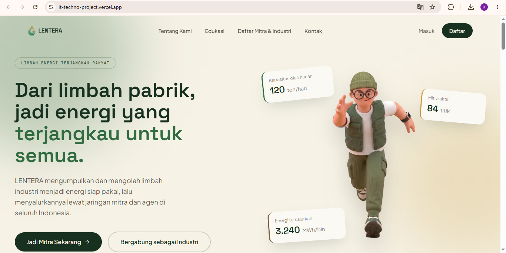
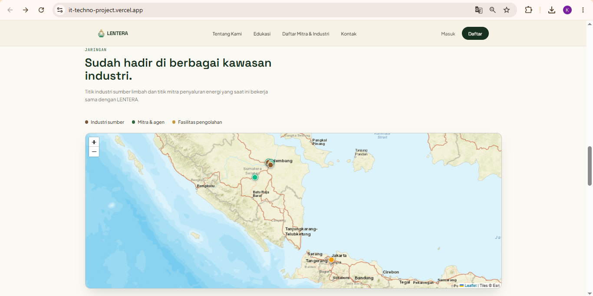
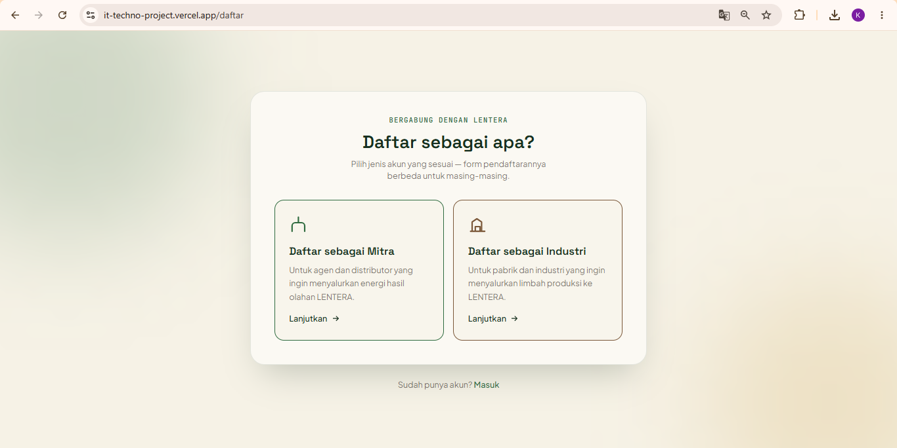
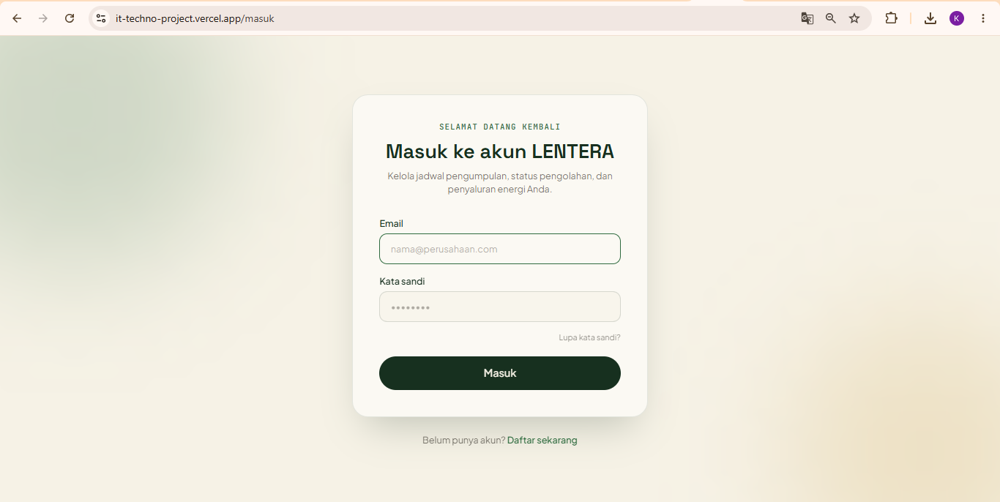
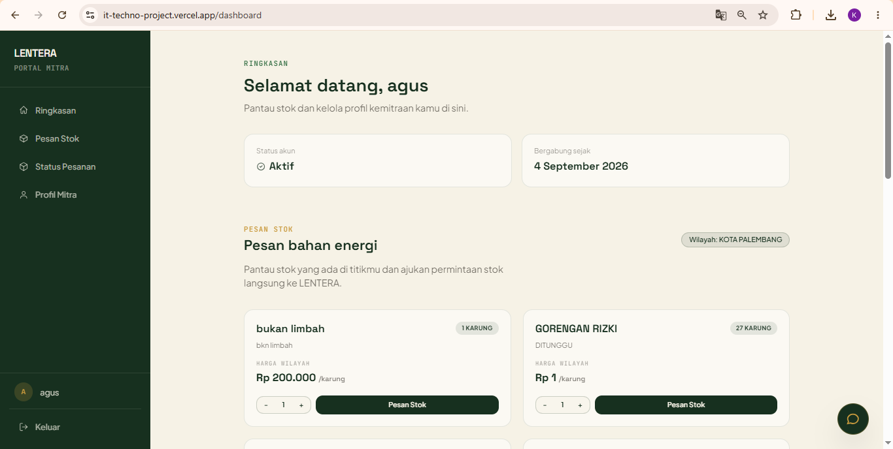
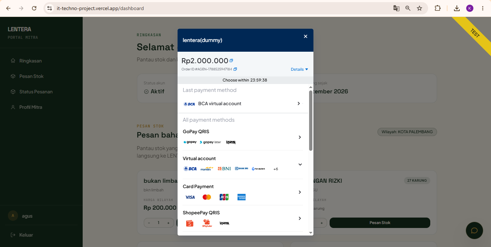
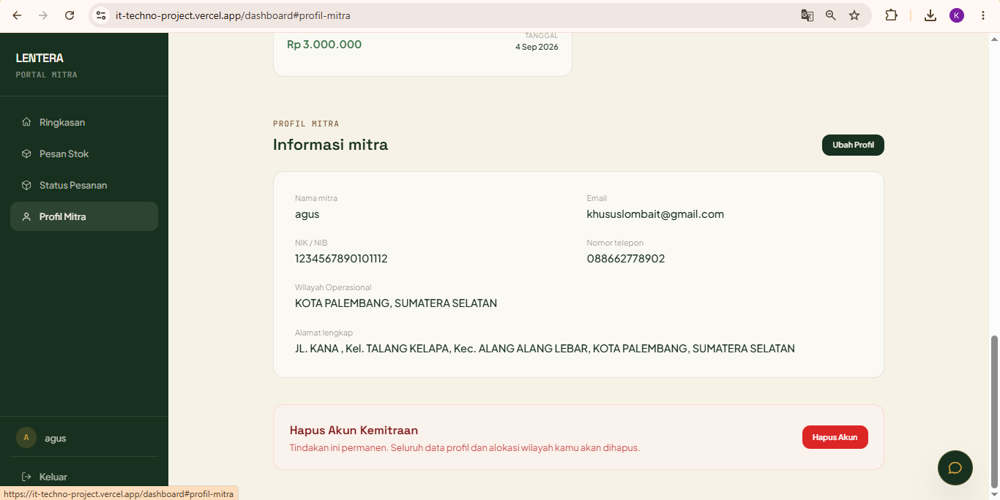
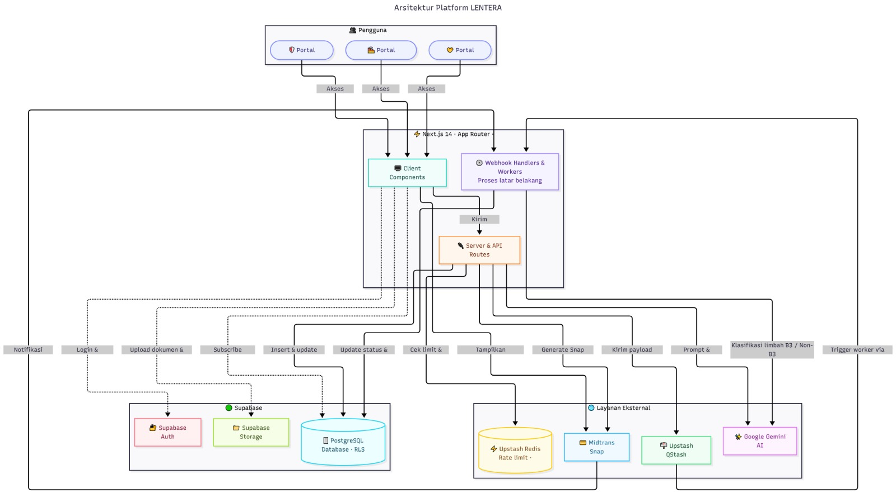
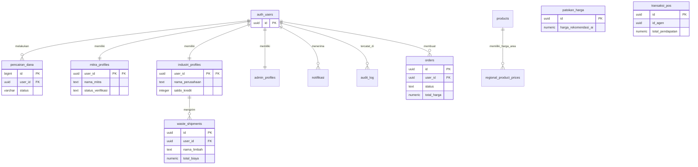

# 🌟 LENTERA (Limbah Energi Terjangkau Rakyat)

[](https://it-techno-project.vercel.app/)
[](https://github.com/migthyhbb/it_techno-project.git)
[](LICENSE)

> **Platform Pengelolaan & Rantai Pasok Limbah Industri Terintegrasi Berbasis Web** 🏭♻️

🏆 **Submission for ITECHNO CUP 2026 - Web Development by Tim Gacor Sekuat** 🏆

---

## 📑 Daftar Isi
- [Tim Developer](#-tim-developer)
- [Tentang Proyek](#-tentang-proyek)
- [Demo & Screenshot](#-demo-screenshot)
- [Fitur Unggulan](#-fitur-unggulan)
- [Teknologi](#-teknologi-infrastruktur)
- [Arsitektur Sistem](#-arsitektur-sistem)
- [User Guide](#-user-guide)
- [API Documentation](#-api-documentation)
- [Lisensi](#-lisensi)

---

## 👥 Tim Developer


**[Raditya Yuda Pratama]** | Project Lead & Frontend Developer | [GitHub](https://github.com/Veltix-00) |

**[M. Habibi Almuzakki]** | Backend Developer | [GitHub](https://github.com/migthyhbb) |

**[M. Rizki Saputra]** |  Web Security | [GitHub](https://github.com/Rzystt) |


---

---
## 🌍 Tentang Proyek

### 📌 Latar Belakang
Pertumbuhan sektor industri di Indonesia berbanding lurus dengan peningkatan volume limbah yang dihasilkan. Sayangnya, tata kelola rantai pasok limbah (*waste supply chain*) masih belum efisien dan terfragmentasi. Banyak material sisa produksi yang sebenarnya memiliki nilai ekonomi (*economic value*) tinggi justru berakhir di TPA (Tempat Pemrosesan Akhir) atau terbuang ke lingkungan tanpa penanganan yang memadai.

Kondisi ini menimbulkan dua permasalahan krusial berskala nasional:
1. **Pencemaran Lingkungan akibat Krisis Akumulasi Limbah:** Berdasarkan data Sistem Informasi Pengelolaan Sampah Nasional (SIPSN) KLHK, Indonesia menghasilkan puluhan juta ton timbulan sampah per tahun, di mana sekitar 33%-38% belum terkelola dengan baik. 
2. **Tingginya Angka Pengangguran:** Data BPS mencatat Tingkat Pengangguran Terbuka (TPT) di Indonesia masih di angka 5,20%. Di sisi lain, potensi penyerapan tenaga kerja di sektor ekonomi sirkular belum tergarap maksimal.

### 💡 Solusi Kami
**LENTERA** hadir sebagai platform *End-to-End Circular Economy* yang menghubungkan sektor Industri manufaktur (penghasil limbah) secara langsung dengan Mitra (pengelola dan pembeli limbah). LENTERA mentransformasi rantai pasok tradisional menjadi ekosistem digital terpadu.

### ⚙️ Cara Kerja Sistem (Workflow)
Platform LENTERA dirancang dengan alur kerja rantai pasok yang terintegrasi, adil, dan aman:
1. **Setor & Hasilkan Keuntungan:** Pihak **Industri** mendaftarkan dan memasukkan data material sisa produksinya ke dalam platform. Alih-alih membayar biaya pembuangan atau membuang limbah ke TPA, Industri justru akan **mendapatkan penghasilan uang tunai** dari setiap limbah yang dijual ke LENTERA.
2. **Penyesuaian Harga Regional:** Sistem LENTERA diatur oleh admin yang otomatis menyesuaikan nilai beli dan nilai jual limbah dengan **Harga Regional** (standar harga komoditas di wilayah provinsi/kota operasional). Hal ini menjamin transparansi dan keadilan harga bagi semua pihak.
3. **Logistik Internal (*In-House Fleet*):** Setelah transaksi dikonfirmasi, LENTERA akan melakukan penjemputan dan pengiriman limbah menggunakan **armada logistik mandiri kami (*internal fleet*)**. Kami tidak menggunakan kurir pihak ketiga, sehingga jaminan keamanan rantai pasok dan kualitas material terjamin 100%.
4. **Distribusi ke Mitra:** Limbah mentah yang telah disortir dan dikelola akan didistribusikan langsung ke titik-titik **Mitra** sebagai bahan baku energi alternatif yang siap digunakan dengan harga terjangkau.

### 🎯 Tujuan Utama
* **♻️ Pengurangan Limbah Industri:** Mengintegrasikan pengelolaan limbah untuk mencapai target *Zero Waste to Landfill*.
* **🤝 Pemberdayaan Ekonomi:** Membuka lapangan pekerjaan baru di bidang pengolahan, penyortiran, dan distribusi rantai pasok.

### 👥 Target Pengguna
* **🏭 Industri:** Sektor manufaktur/badan usaha penghasil limbah.
* **🚚 Mitra:** Pihak pembeli atau pengolah lanjutan produk limbah.
* **🛡️ Administrator:** Tim internal LENTERA (Verifikasi, Keamanan, Transaksi).

### 💎 Value Proposition
* **Fully Integrated Web Platform:** Seluruh siklus transaksi terpusat dalam satu web.
* **Verified & Secure Ecosystem:** Sistem verifikasi KYC/KYB yang ketat.
* **Guaranteed Logistic Risk Transfer:** Skema jaminan keamanan pengiriman barang dengan armada internal.

---
---

## 📸 Demo Screenshot

> **[Kunjungi Live Demo LENTERA di Vercel](https://it-techno-project.vercel.app/)** 🚀

Berikut adalah beberapa tampilan antarmuka dari platform LENTERA:

### 1. Halaman Utama (Landing Page)
Tampilan beranda utama yang menyambut pengguna dengan informasi umum, statistik, dan akses cepat.


### 2. Peta Interaktif Sebaran Wilayah
Peta dinamis yang menampilkan titik lokasi fasilitas industri, mitra, dan pusat pengolahan secara real-time.


### 3. Halaman Pendaftaran (Register)
Pilihan registrasi akun yang terpisah secara jelas antara Mitra dan Industri.


### 4. Halaman Masuk (Login)
Gerbang otentikasi aman untuk mengakses dashboard masing-masing peran pengguna.


### 5. Dashboard Pengguna & Pesan Stok
Panel kontrol utama bagi Mitra untuk memantau status akun dan melakukan pemesanan bahan energi/limbah.

jika katalog produk anda kosong, maka berarti admin belum memasukkan dan menginput data ke dalam website ke daerah yang anda pilih. untuk menginput data, silahkan pergi ke panel admin dan input data sesuai wilayah yang ingin di restock

### 6. Simulasi Pembayaran (Midtrans Gateway)
Integrasi sistem pembayaran digital untuk transaksi pemesanan stok.


### 7. Profil Mitra
Halaman informasi detail akun mitra beserta opsi pengelolaan profil dan manajemen akun.


---

## ✨ Fitur Unggulan

### 🚀 Fitur Utama
* 🎛️ **Multi-Role User Dashboard:** Antarmuka terpisah dan fokus untuk Industri, Mitra, dan Administrator.
* 🛡️ **Automated KYB/KYC Verification:** Sistem validasi otomatis untuk dokumen legalitas bisnis (KTP, NIK, NIB, NPWP) secara aman.
* 💳 **Dynamic Payment Gateway:** Mendukung Transfer Bank, E-Wallet, dan Kartu Kredit tanpa opsi tunai untuk transparansi.
* 🧮 **Transparent Pricing & Tax Calculator:** Kalkulasi otomatis untuk harga, ongkos kirim, dan beban pajak (10-15%).
* 📍 **Order Status & Fleet Tracking:** Pemantauan logistik *real-time* (*Pending, Processing, Delivery*).
* 🤖 **AI Chatbot Assistant & Calculator:** Asisten virtual interaktif untuk navigasi dan kalkulasi limbah.
* 🗺️ **Interactive Real-time Map:** Peta dinamis sebaran lokasi fasilitas Industri dan Mitra.
* 🔒 **Rate Limiting Security:** Proteksi infrastruktur dari serangan massal (*brute force* & DDoS).

### 🛠️ Fitur Tambahan
* ⚖️ **Kendali Moderasi Admin (Ban & Unban)**
* 💰 **Penetapan Harga Regional & Nasional**
* 👤 **Autonomi Akun Mandiri (Self-Management)**
* 🚦 **AI Traffic Queue Management (QStash)**
* 🍪 **Autentikasi Stateful Berbasis Cookies**

---

## 💻 Teknologi Infrastruktur

### 🛠️ Tech Stack
* **Frontend:** React.js, Next.js, Tailwind CSS 🎨
* **Backend:** Supabase, Upstash (QStash & Redis), Midtrans, Next.js API Routes (TypeScript) ⚙️
* **Deployment:** Vercel 🚀
* **Security & Testing:** Postman, K6 🛡️

### 🧠 Alasan Pemilihan Teknologi
* **Next.js & Tailwind CSS:** Kombinasi *Server-Side Rendering* (SSR) dan *utility-first CSS* memastikan performa antarmuka yang sangat cepat dan responsif.
* **Supabase:** Menangani basis data (PostgreSQL), *Realtime*, *Row Level Security* (RLS), *Authentication*, dan *Storage* terenkripsi.
* **Upstash & Midtrans:** Redis menangani *Rate Limiting*, QStash menstabilkan antrean AI, dan Midtrans menjamin transaksi keuangan yang aman.
* **Vercel & K6:** *Global Edge Network* Vercel memastikan *uptime* tinggi, dan K6 memastikan ketahanan beban sistem.

---

## 🏗️ Arsitektur Sistem

### 🖼️ System Architecture
[](public/images/arsitektur.png)
### 🗄️ Database Schema (ERD)

---

### 📂 Folder Structure
```text
it_techno-project/
├── __tests__/                  # Folder pengujian (unit/integration)
├── app/                        # Next.js App Router (Frontend & API)
│   ├── admin/                  # Halaman admin
│   ├── api/                    # Endpoint Backend API
│   │   ├── admin/
│   │   │   ├── calon-mitra/
│   │   │   └── verifikasi/
│   │   ├── auth/
│   │   │   ├── kyc/
│   │   │   ├── login/
│   │   │   └── logout/
│   │   ├── chat/
│   │   ├── daftar/
│   │   │   ├── industri/
│   │   │   └── mitra/
│   │   ├── delete-account/
│   │   ├── gamifikasi/
│   │   │   └── redeem/
│   │   ├── health/
│   │   ├── katalog/
│   │   │   └── produk/
│   │   ├── laporan/
│   │   │   └── kendala/
│   │   ├── leaderboard/
│   │   ├── legal/
│   │   │   └── e-contract/
│   │   ├── limbah/
│   │   │   ├── setoran-limbah/
│   │   │   └── worker/
│   │   ├── partners/
│   │   ├── profil/
│   │   │   └── me/
│   │   ├── setoran-limbah/
│   │   └── transaksi/
│   │       ├── order/
│   │       ├── riwayat/
│   │       ├── update_stock/
│   │       └── webhook/
│   ├── daftar/                 # Halaman pendaftaran 
│   │   ├── industri/
│   │   └── mitra/
│   ├── dashboard-admin/        # Halaman dashboard admin
│   ├── dashboard-industri/     # Halaman dashboard industri
│   ├── edukasi/                # Halaman edukasi
│   ├── kebijakan-privasi/      # Halaman kebijakan privasi
│   ├── kontak/                 # Halaman kontak
│   ├── limbah/                 # Halaman manajemen limbah
│   │   └── setoran-limbah/
│   ├── lupa-sandi/             # Halaman lupa password
│   ├── masuk/                  # Halaman login
│   ├── pipeline/               # Halaman pipeline
│   ├── syarat-ketentuan/       # Halaman syarat & ketentuan
│   └── tentang-kami/           # Halaman tentang kami
├── components/                 # Reusable UI Components
│   ├── auth/
│   ├── dashboard/
│   ├── legal/
│   └── ui/                     # Komponen UI dasar (Shadcn UI)
├── lib/                        # Utility functions, library, & konfigurasi
│   └── supabase/               # Konfigurasi & client Supabase
├── node_modules/               # Dependencies project
└── public/                     # Asset statis (gambar, ikon, font, dll)
    └── images/
```
---

### 📖 User Guide
🏭 Untuk Pengguna Umum (Industri & Mitra)
* Registrasi Akun: Akses halaman utama LENTERA dan klik tombol Daftar pada menu navigasi. Pilih tipe akun operasional Anda (Daftar sebagai Mitra atau Daftar sebagai Industri). Masukkan alamat email aktif untuk menerima kode OTP. Setelah email terverifikasi, buat kata sandi yang kuat dan lengkapi seluruh formulir data perusahaan sesuai instruksi. Setujui Syarat Ketentuan serta Kebijakan Privasi di bagian bawah, lalu klik tombol pendaftaran.

* Autentikasi (Login): Dari halaman beranda, klik tombol Masuk. Masukkan kredensial alamat email dan kata sandi yang telah didaftarkan untuk mengakses dashboard sistem.

* Pemulihan Akun (Lupa Sandi): Pada halaman Masuk, klik tautan Lupa Sandi. Masukkan alamat email terdaftar untuk meminta pengiriman kode OTP. Masukkan kode OTP yang masuk ke inbox Anda, lalu buat dan simpan kata sandi baru.

* Operasional Mitra (Pemesanan Stok): Melalui dashboard utama, buka menu Pesan Stok pada panel sebelah kiri. Tentukan kuantitas barang yang ingin dibeli, lalu klik proses pesanan untuk memilih metode pembayaran.

💡 Catatan Operasional: Apabila katalog produk tampil kosong/tidak tersedia, hal ini mengindikasikan bahwa Administrator pusat belum mengalokasikan data stok untuk wilayah operasional Anda. Ketersediaan suplai diatur secara ketat berdasarkan zonasi regional.
💳 Catatan Uji Coba: LENTERA terintegrasi dengan Midtrans Sandbox. Buka simulator Midtrans, pilih pembayaran Virtual Account seperti BCA, masukkan nomor VA pesanan Anda, lalu klik 'Inquire' untuk menyelesaikan simulasi pembayaran. Pantau pesanan yang berhasil dibayar pada menu status pengiriman. 
> **[Simulasi Midtrans Pembayaran]( https://share.google/EY26blRIrKFW6mSIk)**

* Operasional Industri (Penjemputan Limbah Biasa): Pada dashboard Industri, klik menu Penjemputan Limbah Biasa. Lengkapi formulir pendaftaran dengan memasukkan nama limbah, perkiraan berat, estimasi pendapatan, detail lokasi penjemputan, serta unggah foto dokumentasi limbah. Setelah formulir sesuai, klik Kirim Jadwal. Limbah yang berhasil dijemput dan divalidasi akan dikonversi menjadi kredit pendapatan yang dapat dicairkan (cash out) ke rekening perusahaan.

* Operasional Industri (Pengolahan Limbah B3): Untuk pengelolaan limbah bahan berbahaya dan beracun, klik opsi Daftar Pengolahan B3 dan lengkapi formulir spesifikasi limbah. Setelah pendaftaran berhasil terkonfirmasi, gulir ke menu Tagihan & Transaksi pada halaman status. Klik tombol Konfirmasi Bayar pada tagihan yang berstatus Menunggu Pembayaran, unggah foto bukti transfer sesuai dengan rekening tujuan yang tertera, lalu selesaikan dengan mengeklik Kirim Bukti Pembayaran agar status tagihan diproses oleh Admin.

* Manajemen Profil: Akses menu Profil pada sidebar sebelah kiri. Klik opsi Ubah Profil untuk memperbarui detail operasional atau kontak Anda, lalu klik Simpan Perubahan agar data terekam di sistem.

🛡️ Untuk Admin
 * Akses Admin Panel: Masuk menggunakan kredensial khusus Administrator melalui halaman otentikasi standar untuk mengakses Dashboard Admin terpusat.
 * Verifikasi Calon Pengguna: Akses menu pendaftar baru untuk meninjau kelengkapan dokumen legalitas (KYC/KYB) yang disubmit oleh calon Mitra atau Industri. Lakukan validasi (Approve) atau penolakan status akun berdasarkan keabsahan dokumen.
 * Manajemen Operasional: Pantau aktivitas transaksi keseluruhan, kelola leaderboard gamifikasi, serta tinjau laporan kendala (ticketing) yang diajukan oleh pengguna umum.

 ---

## 🔌 API Documentation

**Base URL:**
```text
Development: http://localhost:3000/api
Production:  [https://it-techno-project.vercel.app/api](https://it-techno-project.vercel.app/api)
```

### Endpoints

## 🔐 Authentication & Pendaftaran
```text
POST   /api/auth/login             # Autentikasi masuk pengguna
POST   /api/auth/logout            # Mengakhiri sesi pengguna
POST   /api/auth/kyc               # Unggah dokumen KYC/KYB
POST   /api/daftar/industri        # Registrasi akun Industri
POST   /api/daftar/mitra           # Registrasi akun Mitra
GET    /api/profil/me              # Mengambil data profil pengguna (sesi aktif)
PATCH  /api/profil/me              # Memperbarui data profil
POST   /api/delete-account         # Menghapus akun pengguna permanen
```
## ♻️ Transaksi & Limbah
```text
GET      /api/katalog/produk         # Mengambil daftar semua produk limbah
POST     /api/limbah/setoran-limbah  # Membuat setoran limbah baru
HANDLER  /api/limbah/setoran-limbah  # Handler spesifik untuk setoran limbah
POST     /api/transaksi/order        # Membuat pesanan/checkout baru
GET      /api/transaksi/riwayat      # Mengambil riwayat transaksi user
POST     /api/transaksi/update_stock # Memperbarui stok setelah transaksi
POST     /api/transaksi/webhook      # Webhook dari Midtrans Payment Gateway
```
## 🛡️ Admin & Operasional
```text
GET    /api/admin/calon-mitra      # Mengambil daftar calon mitra yang mendaftar
PATCH  /api/admin/verifikasi       # Verifikasi/Approve status calon mitra
POST   /api/laporan/kendala        # Mengirim/membuat laporan kendala dari pengguna
GET    /api/leaderboard            # Mendapatkan data peringkat/leaderboard
POST   /api/gamifikasi/redeem      # Menukar poin gamifikasi
POST   /api/chat                   # Endpoint untuk AI Chatbot Assistant
GET    /api/health                 # Cek status kesehatan server (uptime)
```
---

## 📜 Lisensi

Proyek ini dilisensikan di bawah **MIT License**. Lihat file [LICENSE](LICENSE) untuk informasi selengkapnya.

---

<div align="center">


  **Made with ❤️ by Gacor Sekuat for ITECHNO CUP 2026**


 

</div>